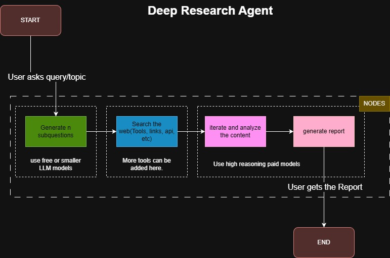
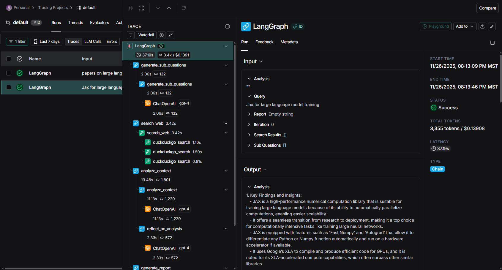

# DeepResearchAgent

Deep Research Agent developed with LangGraph




# Demo

Check out the demo video:

https://github.com/aniketwattamwar/DeepResearchAgent/blob/main/langchain_demo_agent.mp4


## Features

- Multi-step research using LangGraph
- Web search integration with DuckDuckGo
- LangSmith tracing support
- Interactive Gradio UI

## Steps to Run Code

1. **Install required libraries**
   ```bash
   pip install -U langchain langsmith ddgs numpy gradio langgraph langchain-huggingface langchain-openai langchain-community langchain-core huggingface_hub duckduckgo-search
   ```

2. **Configure API Keys**
   - Add your `OPENAI_API_KEY` to the code
   - Add your LangSmith API key to enable tracing

3. **Run the agent**
   ```bash
   python deep_research_agent.py
   ```
   or
   ```bash
   python deep_research_agent_V2.py
   ```

4. **Usage**
   - Enter your research query
   - Configure settings or use defaults

## Steps to Run with UI

Run the V2 version with Gradio interface:
```bash
python deep_research_agent_V2.py
```

The UI will open in your browser automatically.


# Improvements that can be done

- Using different models for different nodes. Example like to generate questions one can use smaller models even open source if works well.
- Use multiple sources rather than search tool that searches arxiv, IEEE, springer links and then another one to going to general web search. This can improve the response well and accurate.
- Token improvement can be done with TOON rather than json as new things are getting developed. Might not work everywhere but saving as much as we can using it.
- Use MCP servers wherever possible.
- Add multiple search tools to get more context like API, MCP servers, inbuilt langchain tools
- Moderator Node that can smartly assign which tools can be best for which sub question.
- Separate out the code of UI and the actual node implementation
- Follow OOPs for each node creation as complexity increases


# Tried few things within the time limit

1. My Laptop is ARM64 had issues with rust and pip installing the langchain libraries and hugging face. Use kaggle notebook also to reverify working.
2. Using different model for generating the questions like kimi k2, deepseek or any other good open source models. Gave issues because of langchain hugging face imports. Code is commented for that.
3. Custom logger to show all the traces of the flow of the nodes, it kept failing. Langrace is open source so tried that. The current code has langsmith with my API key. The project show the traces on the Langsmith UI. Image included
4. Time ran out but tried to make a simple UI with gradio which is in the file deep_research_agent_V2.py. The streaming needs to be fixed a bit
5. MCP server connection


## LangSmith Tracing

View detailed execution traces in LangSmith:

 
